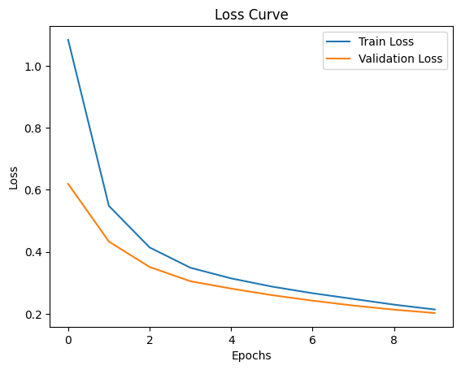
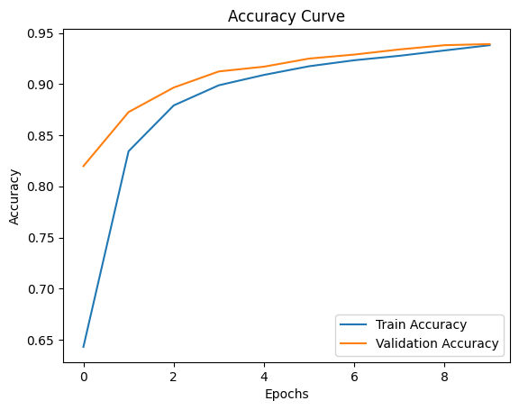

# MNIST Handwritten Digit Classification (ANN)

This project implements a simple **Artificial Neural Network (ANN)** using **TensorFlow/Keras** to classify handwritten digits from the [MNIST dataset](http://yann.lecun.com/exdb/mnist/).

---

## Project Overview
- **Dataset**: MNIST (60,000 training images, 10,000 test images)
- **Input Shape**: 28 × 28 grayscale images
- **Task**: Multi-class classification (digits 0–9)

---

## Model Architecture
- **Flatten Layer** – Converts 28×28 images → 784 vector
- **Dense Layer (128, ReLU)**
- **Dense Layer (32, ReLU)**
- **Dense Layer (10, Softmax)** – Output layer for digit classification

---

## Training
- **Loss Function**: Sparse Categorical Cross-Entropy  
- **Optimizer**: Adam  
- **Metric**: Accuracy  
- **Epochs**: 10  
- **Validation Split**: 20%  

---

## Results
- **Test Accuracy**: 93.82%   
- Training vs Validation Loss and Accuracy plots are included below:

  
  

---

